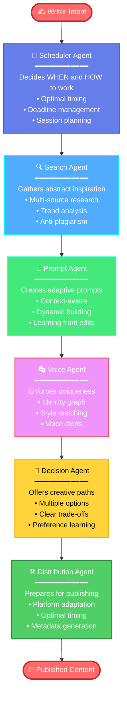
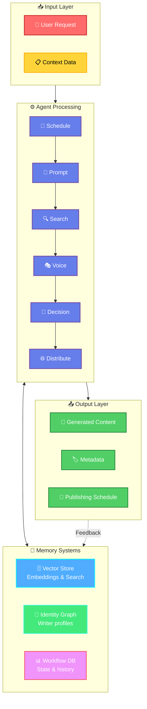
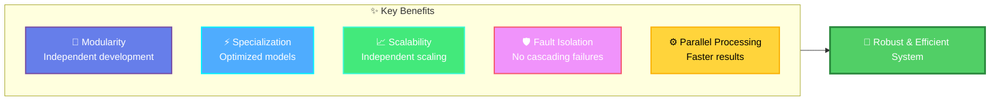
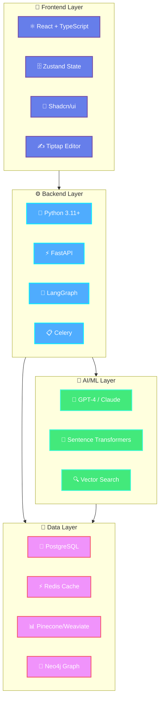

# 🎨 CreativeOps Agent

> **An AI-powered creative assistant that manages your entire workflow—not just your content.**

---

## 📖 Project Overview

**CreativeOps Agent** is an intelligent multi-agent AI system designed to orchestrate end-to-end creative workflows for writers, designers, and marketers. Unlike traditional AI writing tools that simply generate text, CreativeOps Agent acts as a **creative operations platform** that plans, researches, personalizes, and distributes content while preserving your unique voice and creative autonomy.

This is **agentic AI**, not a chatbot. It doesn't replace creativity—it amplifies it.

---

## ⚠️ Problem Statement

### Challenges Faced by Creators

Writers, designers, and marketers face significant operational overhead that extends beyond content creation:

- 📅 **Workflow Management**: Scheduling creative sessions, managing deadlines, and maintaining consistency
- 🔍 **Research Overload**: Gathering inspiration from multiple sources without plagiarizing
- ✍️ **Prompt Engineering**: Struggling to craft effective prompts for AI tools
- 🎭 **Voice Preservation**: Maintaining authentic style across platforms and projects
- 🔄 **Platform Adaptation**: Reformatting content for different audiences and channels
- 📊 **Decision Fatigue**: Making countless creative choices without clear frameworks

### Limitations of Existing AI Tools

Current AI-powered creative tools exhibit critical gaps:

| ❌ Limitation | 📝 Impact |
|--------------|-----------|
| **One-shot generation** | No workflow context or continuity |
| **Generic outputs** | Flattens individual creative voice |
| **No planning support** | Doesn't help with scheduling or ideation |
| **Limited research** | No intelligent inspiration gathering |
| **Single outputs** | No creative alternatives or decision support |
| **Poor adaptation** | Doesn't optimize for different platforms |
| **No learning** | Doesn't improve from user feedback |

---

## ✨ Solution Overview

**CreativeOps Agent** solves these challenges through a **multi-agent architecture** where six specialized AI agents collaborate to manage the complete creative lifecycle.

### 🔄 Agent Workflow Pipeline



**Each agent is a specialist** that operates autonomously while coordinating with others to deliver a seamless creative experience.

---

## 🚀 Key Capabilities

### 📅 **Creative Scheduling Agent**
Learns when you're most creative and suggests optimal writing times. Breaks large projects into manageable sessions (ideation → drafting → refining) and adapts to burnout or deadlines.

### 🤖 **Prompt Engineering Agent**
Dynamically builds context-aware prompts based on your profile, goals, and platform. Evolves prompts as you edit, eliminating the need for manual prompt engineering.

### 🔍 **Intelligent Search & Inspiration Agent**
Searches articles, books, and trends to extract patterns and techniques—not verbatim text. Summarizes insights in your style while maintaining strict anti-plagiarism filters.

### 🎭 **Personalization & Voice Agent**
Builds a writer identity graph from your past work. Adapts all suggestions to match your vocabulary, emotional depth, and cultural context. Alerts you when content drifts from your authentic voice.

### 🎯 **Creative Decision Agent**
Presents multiple creative options with clear trade-offs (e.g., "poetic & subtle" vs. "direct & impactful"). Learns your preferences over time and never forces a single output.

### 🌐 **Distribution & Context Agent**
Adapts content for different platforms (Medium, Instagram, Twitter, etc.) while maintaining voice consistency. Suggests optimal publishing times and generates platform-specific metadata.

---

## 🏗️ System Architecture

### Multi-Agent Architecture Overview

CreativeOps Agent employs a **distributed multi-agent system** where specialized agents operate autonomously while coordinating through a central orchestration layer.

#### 🔷 High-Level Architecture Flow

```mermaid
flowchart TB
    User([👤 User Interface])
    
    User --> Orchestrator
    
    subgraph Orchestrator["🎯 Orchestration Layer"]
        Coordinator["🎛️ Agent Coordinator<br/>Manages lifecycle"]
        Router["� Task Router<rbr/>Routes requests"]
        StateManager["📊 State Manager<br/>Maintains context"]
    end
    
    Orchestrator --> Layer1
    Orchestrator --> Layer2
    
    subgraph Layer1["🤖 Processing Agents - Layer 1"]
        direction LR
        Schedule["📅 Scheduler Agent<br/>━━━━━━━━━━━━<br/>• Optimal timing<br/>• Deadline tracking<br/>• Session planning"]
        Prompt["🤖 Prompt Agent<br/>━━━━━━━━━━━━<br/>• Context-aware<br/>• Adaptive prompts<br/>• Learning"]
        Search["🔍 Search Agent<br/>━━━━━━━━━━━━<br/>• Research<br/>• Inspiration<br/>• Trend analysis"]
    end
    
    Layer1 --> Layer2
    
    subgraph Layer2["🎨 Creative Agents - Layer 2"]
        direction LR
        Voice["🎭 Voice Agent<br/>━━━━━━━━━━━━<br/>• Style analysis<br/>• Voice preservation<br/>• Identity graph"]
        Decision["🎯 Decision Agent<br/>━━━━━━━━━━━━<br/>• Multiple options<br/>• Trade-offs<br/>• Learning"]
        Distribute["🌐 Distribution Agent<br/>━━━━━━━━━━━━<br/>• Platform adapt<br/>• Scheduling<br/>• Metadata"]
    end
    
    Layer2 --> Memory
    
    subgraph Memory["💾 Data & Memory Layer"]
        direction LR
        Identity["🎭 Writer Identity<br/>Graph DB"]
        History["📚 Content History<br/>Vector DB"]
        State["📊 Workflow State<br/>PostgreSQL"]
    end
    
    Memory -.->|Feedback| Orchestrator
    
    style User fill:#ff6b6b,stroke:#c92a2a,stroke-width:3px,color:#fff
    style Coordinator fill:#667eea,stroke:#764ba2,stroke-width:2px,color:#fff
    style Router fill:#667eea,stroke:#764ba2,stroke-width:2px,color:#fff
    style StateManager fill:#667eea,stroke:#764ba2,stroke-width:2px,color:#fff
    style Schedule fill:#4facfe,stroke:#00f2fe,stroke-width:2px,color:#fff
    style Prompt fill:#4facfe,stroke:#00f2fe,stroke-width:2px,color:#fff
    style Search fill:#4facfe,stroke:#00f2fe,stroke-width:2px,color:#fff
    style Voice fill:#43e97b,stroke:#38f9d7,stroke-width:2px,color:#fff
    style Decision fill:#43e97b,stroke:#38f9d7,stroke-width:2px,color:#fff
    style Distribute fill:#43e97b,stroke:#38f9d7,stroke-width:2px,color:#fff
    style Identity fill:#f093fb,stroke:#f5576c,stroke-width:2px,color:#fff
    style History fill:#f093fb,stroke:#f5576c,stroke-width:2px,color:#fff
    style State fill:#f093fb,stroke:#f5576c,stroke-width:2px,color:#fff
```



---

#### 🔄 Agent Collaboration Flow

> **How agents work together on a typical creative task**

```mermaid
flowchart LR
    Start([🚀 User Request]) --> Intent[🔍 Analyze Intent]
    
    Intent --> Schedule[📅 Check Schedule<br/>Optimal timing]
    Schedule --> Research[🔍 Gather Research<br/>Find inspiration]
    
    Research --> Prompt[🤖 Generate Prompts<br/>Context-aware]
    Prompt --> Voice[🎭 Apply Voice<br/>Style matching]
    
    Voice --> Generate[✨ Generate Content<br/>Multiple options]
    
    Generate --> Option1[📝 Option 1<br/>Conservative]
    Generate --> Option2[📝 Option 2<br/>Balanced]
    Generate --> Option3[📝 Option 3<br/>Bold]
    
    Option1 --> Review{👤 User<br/>Review}
    Option2 --> Review
    Option3 --> Review
    
    Review -->|Approve| Adapt[🌐 Platform Adapt<br/>Multi-channel]
    Review -->|Edit| Refine[✏️ Refine]
    Review -->|Reject| Generate
    
    Refine --> Adapt
    
    Adapt --> Blog[📰 Blog]
    Adapt --> Social[📱 Social]
    Adapt --> Email[📧 Email]
    
    Blog --> Complete([✅ Complete])
    Social --> Complete
    Email --> Complete
    
    Complete -.->|Learn| Intent
    
    style Start fill:#667eea,stroke:#764ba2,stroke-width:3px,color:#fff
    style Intent fill:#4facfe,stroke:#00f2fe,stroke-width:2px,color:#fff
    style Schedule fill:#43e97b,stroke:#38f9d7,stroke-width:2px,color:#fff
    style Research fill:#f093fb,stroke:#f5576c,stroke-width:2px,color:#fff
    style Prompt fill:#ffd43b,stroke:#fab005,stroke-width:2px,color:#000
    style Voice fill:#667eea,stroke:#764ba2,stroke-width:2px,color:#fff
    style Generate fill:#43e97b,stroke:#38f9d7,stroke-width:2px,color:#fff
    style Option1 fill:#4facfe,stroke:#00f2fe,stroke-width:2px,color:#fff
    style Option2 fill:#4facfe,stroke:#00f2fe,stroke-width:2px,color:#fff
    style Option3 fill:#4facfe,stroke:#00f2fe,stroke-width:2px,color:#fff
    style Review fill:#ff6b6b,stroke:#c92a2a,stroke-width:3px,color:#fff
    style Refine fill:#ffd43b,stroke:#fab005,stroke-width:2px,color:#000
    style Adapt fill:#43e97b,stroke:#38f9d7,stroke-width:2px,color:#fff
    style Blog fill:#51cf66,stroke:#2b8a3e,stroke-width:2px,color:#fff
    style Social fill:#51cf66,stroke:#2b8a3e,stroke-width:2px,color:#fff
    style Email fill:#51cf66,stroke:#2b8a3e,stroke-width:2px,color:#fff
    style Complete fill:#667eea,stroke:#764ba2,stroke-width:3px,color:#fff
```



---

#### 🧠 Data Flow & Memory Architecture



### Why Agent-Based Architecture?



| 🎯 Advantage | ✅ Benefit |
|-------------|-----------|
| **🧩 Modularity** | Each agent can be developed and deployed independently |
| **⚡ Specialized Optimization** | Different agents use different AI models and techniques |
| **📈 Scalability** | Agents scale independently based on load |
| **🛡️ Fault Isolation** | Agent failures don't cascade across the system |
| **⚙️ Parallel Processing** | Multiple agents work simultaneously for faster results |

---

## 👥 Target Users

### ✍️ Writers
Bloggers, journalists, novelists, and content writers who need consistent output, voice preservation, and multi-platform publishing.

### 🎨 Designers
Visual creators, UI/UX designers, and brand designers who need inspiration gathering, design brief generation, and asset adaptation.

### 📢 Marketers
Content marketers, campaign managers, and social media managers who need multi-channel campaigns, audience segmentation, and performance optimization.

---

## 🛠️ Technology Stack



<details>
<summary><b>📦 Detailed Technology Breakdown</b></summary>
<br>

### Frontend
- **Framework**: React with TypeScript
- **State Management**: Zustand
- **UI Components**: Shadcn/ui
- **Rich Text Editor**: Tiptap

### Backend
- **Language**: Python 3.11+
- **Framework**: FastAPI
- **Agent Framework**: LangGraph
- **Task Queue**: Celery

### AI/ML Layer
- **LLM**: OpenAI GPT-4 / Anthropic Claude
- **Embeddings**: Sentence Transformers
- **Vector Search**: Pinecone or Weaviate

### Databases
- **Primary**: PostgreSQL
- **Cache**: Redis
- **Vector DB**: Pinecone/Weaviate
- **Graph DB**: Neo4j (for writer identity)

</details>

---

## 📂 Repository Structure

```
CreativeOps-Agent/
│
├── requirements.md          # Detailed functional requirements
├── design.md               # System architecture and design
├── README.md               # This file
└── LICENSE                 # Project license
```

### Key Documents

- **`requirements.md`**: Comprehensive user stories, acceptance criteria, and success metrics for all six agents
- **`design.md`**: Technical architecture, data models, algorithms, correctness properties, and testing strategy

---

## 🧠 How This Project Was Built

This project was designed using **Kiro AI**, an AI-powered development assistant that helped structure the requirements and design through an iterative, specification-driven approach.

### Design Process

1. **Problem Definition**: Identified gaps in existing creative AI tools
2. **Requirements Gathering**: Defined user stories and acceptance criteria for each agent
3. **Architecture Design**: Designed multi-agent system with clear separation of concerns
4. **Correctness Properties**: Established testable properties for voice preservation, anti-plagiarism, and performance
5. **Documentation**: Generated comprehensive requirements and design documents

This structured approach ensures the system is **buildable, testable, and maintainable** from day one.

---

## 🔮 Future Enhancements

### Phase 2
- 🤝 **Collaborative Writing**: Multi-writer projects with voice blending
- 📊 **Advanced Analytics**: Deep insights into creative patterns and productivity
- 📱 **Mobile App**: iOS and Android support for on-the-go creativity
- 🔗 **Platform Integrations**: Direct publishing to Medium, Substack, WordPress

### Phase 3
- 🌍 **Multi-Language Support**: Creative assistance in multiple languages
- 🎙️ **Audio/Video Adaptation**: Extend to podcasts and video scripts
- 💰 **Creator Monetization**: Tools for tracking and optimizing content revenue
- 👥 **Community Features**: Connect creators with similar styles and goals

---

## 🎯 Conclusion

**CreativeOps Agent** represents a fundamental shift in how AI assists creative professionals. Rather than replacing human creativity with generic outputs, it **amplifies creative potential** by managing the operational complexity of modern content creation.

By preserving individual voice, offering intelligent choices, and orchestrating the entire workflow from ideation to distribution, CreativeOps Agent empowers writers, designers, and marketers to focus on what they do best: **creating**.

---

<div align="center">

**Built with 🧠 by leveraging agentic AI architecture**

*This is not a writing tool. This is a creative operations platform.*

</div>
