<div align="center">

# 🏗️ CreativeOps Agent
## System Design Document

[]()
[]()
[]()

> *Intelligent multi-agent architecture for orchestrating creative workflows*

</div>

---

## 📑 Table of Contents

1. [System Overview](#1-system-overview)
2. [High-Level Architecture](#2-high-level-architecture)

---

## 1. System Overview

### 1.1 🎯 Purpose

**CreativeOps Agent** is an AI-powered multi-agent system designed to manage the entire creative workflow lifecycle for professional content creators. Unlike simple content generation tools, this system acts as an intelligent creative operations platform that orchestrates planning, research, ideation, personalization, decision-making, and distribution while preserving each creator's unique voice and maintaining creative autonomy.

<details open>
<summary><b>🎨 The Creative Workflow Gap</b></summary>
<br>

The system addresses a critical gap in creative workflows: **the operational overhead of managing creative processes**. 

Writers, designers, and marketers spend significant time on non-creative tasks:
- 📅 Scheduling and planning
- 🔍 Research and information gathering
- ✍️ Prompt refinement
- 🔄 Platform adaptation
- 📊 Performance analysis

**CreativeOps Agent** automates these operational aspects while keeping humans firmly in control of creative decisions.

</details>

### 1.2 👥 Target Users

<table>
<tr>
<td width="33%" valign="top">

#### ✍️ Writers

**Profile:**
- Authors
- Bloggers
- Journalists
- Content Writers

**Needs:**
- Consistent output
- Voice preservation
- Multi-platform publishing
- Format adaptation

</td>
<td width="33%" valign="top">

#### 🎨 Designers

**Profile:**
- Visual Creators
- UI/UX Designers
- Brand Designers
- Digital Artists

**Needs:**
- Inspiration gathering
- Design brief generation
- Asset adaptation
- Brand consistency

</td>
<td width="33%" valign="top">

#### 📢 Marketers

**Profile:**
- Content Marketers
- Campaign Managers
- Social Media Managers
- Growth Marketers

**Needs:**
- Multi-channel campaigns
- Audience segmentation
- Performance optimization
- Creative testing

</td>
</tr>
</table>

### 1.3 💡 Key Design Philosophy

The system is built on **four foundational principles**:

<table>
<tr>
<td width="50%" valign="top">

#### 🤖 Agentic AI Architecture

Rather than a monolithic AI model, the system employs **specialized autonomous agents** that collaborate to handle distinct aspects of the creative workflow.

**Benefits:**
- ✅ Targeted optimization
- ✅ Independent scaling
- ✅ Clear separation of concerns
- ✅ Modular development

</td>
<td width="50%" valign="top">

#### 🎨 Creativity Preservation

The system **never replaces human creativity** but amplifies it. All creative decisions remain human-driven, with AI providing options, context, and operational support.

**Approach:**
- 🎯 AI suggests, humans decide
- 🎭 Voice preservation
- 🔄 Iterative refinement
- 💡 Inspiration, not replacement

</td>
</tr>
<tr>
<td width="50%" valign="top">

#### 👤 Human-in-the-Loop

Critical creative choices require **explicit human approval**. The system learns from these decisions to improve future recommendations while respecting creative evolution.

**Features:**
- ✋ Approval gates
- 📈 Learning from feedback
- 🔄 Continuous improvement
- 🎯 Adaptive recommendations

</td>
<td width="50%" valign="top">

#### 🎭 Identity-Aware Personalization

The system builds and maintains a **deep understanding** of each creator's style, preferences, and voice, ensuring all assistance aligns with their creative identity.

**Capabilities:**
- 📊 Style analysis
- 🎨 Voice modeling
- 🔍 Preference learning
- 🎯 Personalized outputs

</td>
</tr>
</table>

---

## 2. High-Level Architecture

### 2.1 🏛️ Multi-Agent Architecture Overview

**CreativeOps Agent** employs a **distributed multi-agent architecture** where **six specialized agents** operate autonomously while coordinating through a central orchestration layer. Each agent is responsible for a specific domain of the creative workflow and communicates through well-defined interfaces.

#### 🔷 Interactive Architecture Diagram

> **💡 Tip:** Click on the diagram to zoom in/out and explore the architecture in detail!


#### 🔷 Agent Responsibilities

| Agent | Icon | Primary Function | Key Capabilities |
|-------|------|------------------|------------------|
| **Creative Scheduling** | 📅 | Workflow planning & timeline management | Project scheduling, deadline tracking, task automation |
| **Prompt Engineering** | 🤖 | Intelligent prompt generation | Context-aware prompts, adaptive complexity, learning |
| **Search & Inspiration** | 🔍 | Research aggregation & trend analysis | Multi-source search, mood boards, trend identification |
| **Personalization & Voice** | 🎭 | Creative identity preservation | Style analysis, voice modeling, brand consistency |
| **Creative Decision** | 🎯 | Multi-option generation & decision support | Alternative generation, A/B testing, feedback learning |
| **Distribution & Context** | 🌐 | Platform adaptation & content distribution | Format adaptation, scheduling, metadata generation |

---

#### 🔄 Data Flow Diagram

> **Visualizing how data flows through the system**

```mermaid
flowchart LR
    User([👤 User])
    
    subgraph Input["📥 Input Processing"]
        Request[User Request]
        Intent[Intent Analysis]
    end
    
    subgraph Processing["⚙️ Agent Processing"]
        direction TB
        A1[📅 Schedule]
        A2[🤖 Prompt]
        A3[🔍 Search]
        A4[🎭 Voice]
        A5[🎯 Decision]
        A6[🌐 Distribute]
    end
    
    subgraph Output["📤 Output Generation"]
        Result[Generated Content]
        Feedback[User Feedback]
    end
    
    subgraph Learning["🧠 Learning Loop"]
        Store[Store Feedback]
        Improve[Improve Models]
    end
    
    User -->|Submit| Request
    Request --> Intent
    Intent -->|Route| Processing
    
    A1 -.->|Parallel| A2
    A2 -.->|Parallel| A3
    A3 -.->|Parallel| A4
    A4 -.->|Sequential| A5
    A5 --> A6
    
    Processing --> Result
    Result --> User
    User -->|Provide| Feedback
    Feedback --> Store
    Store --> Improve
    Improve -.->|Update| Processing
    
    style User fill:#ff6b6b,stroke:#c92a2a,stroke-width:3px,color:#fff
    style Request fill:#4ecdc4,stroke:#1a535c,stroke-width:2px,color:#fff
    style Intent fill:#4ecdc4,stroke:#1a535c,stroke-width:2px,color:#fff
    style A1 fill:#667eea,stroke:#764ba2,stroke-width:2px,color:#fff
    style A2 fill:#667eea,stroke:#764ba2,stroke-width:2px,color:#fff
    style A3 fill:#667eea,stroke:#764ba2,stroke-width:2px,color:#fff
    style A4 fill:#667eea,stroke:#764ba2,stroke-width:2px,color:#fff
    style A5 fill:#667eea,stroke:#764ba2,stroke-width:2px,color:#fff
    style A6 fill:#667eea,stroke:#764ba2,stroke-width:2px,color:#fff
    style Result fill:#51cf66,stroke:#2b8a3e,stroke-width:2px,color:#fff
    style Feedback fill:#ffd43b,stroke:#fab005,stroke-width:2px,color:#000
    style Store fill:#ff8787,stroke:#fa5252,stroke-width:2px,color:#fff
    style Improve fill:#ff8787,stroke:#fa5252,stroke-width:2px,color:#fff
```



---

#### 🔀 Agent Interaction Flow

> **How agents collaborate on a typical creative task**

```mermaid
sequenceDiagram
    participant U as 👤 User
    participant O as 🎯 Orchestrator
    participant S as 📅 Schedule Agent
    participant P as 🤖 Prompt Agent
    participant R as 🔍 Search Agent
    participant V as 🎭 Voice Agent
    participant D as 🎯 Decision Agent
    participant Dist as 🌐 Distribution Agent
    participant M as 💾 Memory

    U->>O: Create blog post for next week
    O->>S: Check schedule & deadlines
    S->>M: Query workflow state
    M-->>S: Return schedule data
    S-->>O: Optimal time: Wednesday 2PM
    
    O->>P: Generate content prompts
    P->>M: Fetch user preferences
    M-->>P: Return prompt history
    P-->>O: 3 prompt variations
    
    par Parallel Research
        O->>R: Gather inspiration
        R->>M: Search embeddings
        M-->>R: Relevant content
        R-->>O: Research summary
    and Voice Analysis
        O->>V: Analyze user style
        V->>M: Query identity graph
        M-->>V: Style profile
        V-->>O: Voice parameters
    end
    
    O->>D: Generate content options
    D->>M: Apply learned preferences
    M-->>D: User patterns
    D-->>O: 3 content alternatives
    
    O->>U: Present options
    U->>O: Select option 2 + edits
    
    O->>Dist: Prepare for distribution
    Dist->>M: Store final content
    Dist-->>O: Ready for publishing
    
    O->>M: Store feedback & choices
    M-->>O: Learning updated
    O-->>U: ✅ Content ready!

    Note over U,M: Continuous learning from user choices
```



---

#### 🏗️ Complete System Architecture

> **Full end-to-end architecture with all components and connections**

```mermaid
graph TB
    subgraph External["🌍 External Services"]
        LLM["🧠 LLM APIs<br/>(GPT-4, Claude)"]
        SearchAPI["🔍 Search APIs<br/>(Google, Bing)"]
        CloudStorage["☁️ Cloud Storage<br/>(S3, Azure)"]
    end

    subgraph Frontend["🎨 Frontend Layer"]
        Dashboard["📊 Dashboard<br/>Project overview"]
        Editor["✍️ Content Editor<br/>Rich text editing"]
        Analytics["📈 Analytics<br/>Performance metrics"]
    end

    subgraph Gateway["🚪 API Gateway"]
        Auth["🔐 Authentication<br/>JWT/OAuth"]
        RateLimit["⏱️ Rate Limiting<br/>Request throttling"]
        LoadBalancer["⚖️ Load Balancer<br/>Traffic distribution"]
    end

    subgraph Core["⚙️ Core System"]
        direction TB
        
        subgraph Orchestrator["🎯 Orchestration Engine"]
            TaskQueue["📋 Task Queue<br/>(Redis/RabbitMQ)"]
            Scheduler["⏰ Job Scheduler<br/>(Celery)"]
            EventBus["📡 Event Bus<br/>(Kafka)"]
        end

        subgraph AgentCluster["🤖 Agent Cluster"]
            direction LR
            A1["📅<br/>Schedule"]
            A2["🤖<br/>Prompt"]
            A3["🔍<br/>Search"]
            A4["🎭<br/>Voice"]
            A5["🎯<br/>Decision"]
            A6["🌐<br/>Distribute"]
        end

        subgraph Intelligence["🧠 AI/ML Layer"]
            Embeddings["🔢 Embedding Models<br/>(Sentence Transformers)"]
            Classification["🏷️ Classification<br/>(Intent, Sentiment)"]
            Generation["✨ Generation<br/>(Content, Prompts)"]
        end
    end

    subgraph DataLayer["💾 Data & Storage Layer"]
        direction LR
        Primary["🗄️ Primary DB<br/>(PostgreSQL)"]
        Cache["⚡ Cache<br/>(Redis)"]
        Vector["🔢 Vector DB<br/>(Pinecone/Weaviate)"]
        Graph["🔗 Graph DB<br/>(Neo4j)"]
        TimeSeries["📊 Time Series<br/>(InfluxDB)"]
    end

    subgraph Monitoring["📊 Monitoring & Observability"]
        Logs["📝 Logging<br/>(ELK Stack)"]
        Metrics["📈 Metrics<br/>(Prometheus)"]
        Tracing["🔍 Tracing<br/>(Jaeger)"]
        Alerts["🚨 Alerting<br/>(PagerDuty)"]
    end

    %% Frontend to Gateway
    Dashboard --> Auth
    Editor --> Auth
    Analytics --> Auth

    %% Gateway to Core
    Auth --> LoadBalancer
    RateLimit --> LoadBalancer
    LoadBalancer --> TaskQueue

    %% Orchestration flow
    TaskQueue --> Scheduler
    Scheduler --> EventBus
    EventBus --> AgentCluster

    %% Agent to Intelligence
    AgentCluster --> Intelligence

    %% Intelligence to External
    Intelligence --> LLM
    Intelligence --> SearchAPI

    %% Core to Data Layer
    AgentCluster --> Primary
    AgentCluster --> Cache
    AgentCluster --> Vector
    AgentCluster --> Graph
    Intelligence --> Vector

    %% Analytics data
    AgentCluster --> TimeSeries
    
    %% External storage
    A6 --> CloudStorage

    %% Monitoring connections
    Core -.->|Logs| Logs
    Core -.->|Metrics| Metrics
    Core -.->|Traces| Tracing
    Metrics -.->|Alerts| Alerts

    %% Styling
    classDef externalStyle fill:#ff6b6b,stroke:#c92a2a,stroke-width:2px,color:#fff
    classDef frontendStyle fill:#667eea,stroke:#764ba2,stroke-width:2px,color:#fff
    classDef gatewayStyle fill:#f093fb,stroke:#f5576c,stroke-width:2px,color:#fff
    classDef coreStyle fill:#4facfe,stroke:#00f2fe,stroke-width:2px,color:#fff
    classDef dataStyle fill:#43e97b,stroke:#38f9d7,stroke-width:2px,color:#fff
    classDef monitorStyle fill:#ffd43b,stroke:#fab005,stroke-width:2px,color:#000

    class LLM,SearchAPI,CloudStorage externalStyle
    class Dashboard,Editor,Analytics frontendStyle
    class Auth,RateLimit,LoadBalancer gatewayStyle
    class TaskQueue,Scheduler,EventBus,A1,A2,A3,A4,A5,A6,Embeddings,Classification,Generation coreStyle
    class Primary,Cache,Vector,Graph,TimeSeries dataStyle
    class Logs,Metrics,Tracing,Alerts monitorStyle
```



---

#### 🔄 Content Creation Workflow

> **Step-by-step flow of creating and distributing content**

```mermaid
stateDiagram-v2
    [*] --> UserRequest: User initiates content creation
    
    UserRequest --> IntentAnalysis: Analyze request
    IntentAnalysis --> ScheduleCheck: Check timeline
    
    ScheduleCheck --> PromptGeneration: Generate prompts
    PromptGeneration --> ResearchPhase: Gather inspiration
    
    state ResearchPhase {
        [*] --> WebSearch
        [*] --> TrendAnalysis
        [*] --> MoodBoard
        WebSearch --> Aggregation
        TrendAnalysis --> Aggregation
        MoodBoard --> Aggregation
        Aggregation --> [*]
    }
    
    ResearchPhase --> VoiceAnalysis: Apply user style
    VoiceAnalysis --> ContentGeneration: Generate options
    
    state ContentGeneration {
        [*] --> Option1
        [*] --> Option2
        [*] --> Option3
        Option1 --> [*]
        Option2 --> [*]
        Option3 --> [*]
    }
    
    ContentGeneration --> UserReview: Present to user
    
    state UserReview {
        [*] --> Evaluate
        Evaluate --> Approve: ✅ Accept
        Evaluate --> Edit: ✏️ Modify
        Evaluate --> Reject: ❌ Decline
        Edit --> Approve
        Reject --> ContentGeneration: Regenerate
    }
    
    UserReview --> PlatformAdaptation: Adapt for platforms
    
    state PlatformAdaptation {
        [*] --> Blog
        [*] --> Social
        [*] --> Email
        [*] --> Newsletter
        Blog --> [*]
        Social --> [*]
        Email --> [*]
        Newsletter --> [*]
    }
    
    PlatformAdaptation --> Distribution: Schedule & publish
    Distribution --> FeedbackCollection: Collect metrics
    FeedbackCollection --> Learning: Update models
    Learning --> [*]: Complete
    
    note right of UserReview
        Human-in-the-loop
        decision point
    end note
    
    note right of Learning
        Continuous improvement
        from user feedback
    end note
```



### 2.2 🤔 Why Agent-Based Architecture?

<details open>
<summary><b>Key Advantages of Multi-Agent Design</b></summary>
<br>

| 🎯 Advantage | 📝 Description | ✅ Benefit |
|-------------|----------------|-----------|
| **🧩 Modularity** | Each agent can be developed, tested, and deployed independently | Updates to one agent don't affect others |
| **⚡ Specialized Optimization** | Different agents use different AI models and techniques | Personalization uses embeddings, Decision uses RL |
| **📈 Scalability** | Agents scale independently based on load | Search operations can scale without affecting scheduling |
| **🛡️ Fault Isolation** | Agent failures don't cascade | System remains functional even if one agent fails |
| **⚙️ Parallel Processing** | Multiple agents work simultaneously | Significantly reduced end-to-end latency |

</details>

#### 💡 Architecture Benefits

```
Traditional Monolithic AI          →    Multi-Agent Architecture
━━━━━━━━━━━━━━━━━━━━━━━━━━━━━━━━━━━━━━━━━━━━━━━━━━━━━━━━━━━━━━━━━━

❌ Single point of failure         →    ✅ Distributed resilience
❌ One-size-fits-all model         →    ✅ Specialized optimization
❌ Difficult to scale              →    ✅ Independent scaling
❌ Complex maintenance             →    ✅ Modular updates
❌ Sequential processing           →    ✅ Parallel execution
```

### 2.3 🎛️ Central Orchestration Layer

The **orchestration layer** is the brain of the system, managing agent lifecycle, coordinating inter-agent communication, maintaining workflow state, and ensuring consistency.

#### Core Responsibilities

<table>
<tr>
<td width="50%" valign="top">

##### 🔀 Task Routing

Analyzes user intent and routes requests to appropriate agents.

**Features:**
- Intent classification
- Agent selection
- Priority management
- Load balancing

</td>
<td width="50%" valign="top">

##### 🔗 Dependency Management

Ensures agents execute in the correct order with proper data flow.

**Features:**
- Dependency graphs
- Sequential execution
- Parallel coordination
- Data passing

</td>
</tr>
</table>

---

<div align="center">

### 📊 System Architecture Summary

#### 🛠️ Technology Stack Visualization

```mermaid
mindmap
  root((🎨 CreativeOps<br/>Agent))
    Frontend 🖥️
      React
      Next.js
      TypeScript
      Tailwind CSS
    Backend ⚙️
      Python
      FastAPI
      LangChain
      Celery
    AI/ML 🧠
      OpenAI GPT-4
      Claude
      Sentence Transformers
      Hugging Face
    Databases 💾
      PostgreSQL
      Redis
      Pinecone
      Neo4j
      InfluxDB
    Infrastructure ☁️
      Docker
      Kubernetes
      AWS/Azure
      Terraform
    Monitoring 📊
      Prometheus
      Grafana
      ELK Stack
      Jaeger
```



---

#### 🎯 Architecture Layers Overview

| Layer | Components | Purpose | Technology |
|-------|-----------|---------|------------|
| **🎨 Presentation** | Web App, Mobile, Extensions | User interaction | React, Next.js, TypeScript |
| **🚪 Gateway** | API Gateway, Auth, Rate Limiting | Request handling | FastAPI, JWT, Redis |
| **🎯 Orchestration** | Task Queue, Scheduler, Event Bus | Workflow coordination | Celery, RabbitMQ, Kafka |
| **🤖 Agent** | 6 Specialized Agents | Domain-specific processing | Python, LangChain, Custom |
| **🧠 Intelligence** | ML Models, Embeddings | AI capabilities | OpenAI, Transformers, PyTorch |
| **💾 Data** | Databases, Cache, Storage | Persistence & retrieval | PostgreSQL, Redis, Vector DBs |
| **📊 Observability** | Logging, Metrics, Tracing | System monitoring | Prometheus, ELK, Jaeger |

---

#### 🔐 Security Architecture

```mermaid
graph LR
    User[👤 User]
    
    subgraph Security["🔐 Security Layer"]
        WAF["🛡️ Web Application<br/>Firewall"]
        Auth["🔑 Authentication<br/>(OAuth 2.0/JWT)"]
        RBAC["👥 Role-Based<br/>Access Control"]
        Encrypt["🔒 Encryption<br/>(TLS 1.3)"]
    end
    
    subgraph Protection["🛡️ Data Protection"]
        AtRest["💾 Encryption<br/>at Rest"]
        InTransit["📡 Encryption<br/>in Transit"]
        Backup["💿 Encrypted<br/>Backups"]
    end
    
    subgraph Compliance["✅ Compliance"]
        GDPR["🇪🇺 GDPR"]
        CCPA["🇺🇸 CCPA"]
        SOC2["📋 SOC 2"]
    end
    
    User --> WAF
    WAF --> Auth
    Auth --> RBAC
    RBAC --> Encrypt
    
    Encrypt --> AtRest
    Encrypt --> InTransit
    Encrypt --> Backup
    
    Protection --> GDPR
    Protection --> CCPA
    Protection --> SOC2
    
    style User fill:#ff6b6b,stroke:#c92a2a,stroke-width:3px,color:#fff
    style WAF fill:#667eea,stroke:#764ba2,stroke-width:2px,color:#fff
    style Auth fill:#667eea,stroke:#764ba2,stroke-width:2px,color:#fff
    style RBAC fill:#667eea,stroke:#764ba2,stroke-width:2px,color:#fff
    style Encrypt fill:#667eea,stroke:#764ba2,stroke-width:2px,color:#fff
    style AtRest fill:#43e97b,stroke:#38f9d7,stroke-width:2px,color:#fff
    style InTransit fill:#43e97b,stroke:#38f9d7,stroke-width:2px,color:#fff
    style Backup fill:#43e97b,stroke:#38f9d7,stroke-width:2px,color:#fff
    style GDPR fill:#ffd43b,stroke:#fab005,stroke-width:2px,color:#000
    style CCPA fill:#ffd43b,stroke:#fab005,stroke-width:2px,color:#000
    style SOC2 fill:#ffd43b,stroke:#fab005,stroke-width:2px,color:#000
```



---

#### 📈 Scalability & Performance

```mermaid
graph TB
    subgraph Load["📊 Load Distribution"]
        LB1["⚖️ Load Balancer 1"]
        LB2["⚖️ Load Balancer 2"]
    end
    
    subgraph AppTier["🖥️ Application Tier - Auto Scaling"]
        App1["🟢 Instance 1"]
        App2["🟢 Instance 2"]
        App3["🟢 Instance 3"]
        AppN["🟢 Instance N"]
    end
    
    subgraph AgentTier["🤖 Agent Tier - Horizontal Scaling"]
        Agent1["🤖 Agent Pool 1"]
        Agent2["🤖 Agent Pool 2"]
        Agent3["🤖 Agent Pool 3"]
    end
    
    subgraph CacheTier["⚡ Caching Layer"]
        Redis1["Redis Primary"]
        Redis2["Redis Replica 1"]
        Redis3["Redis Replica 2"]
    end
    
    subgraph DBTier["💾 Database Tier"]
        DBPrimary["🗄️ Primary DB"]
        DBReplica1["📖 Read Replica 1"]
        DBReplica2["📖 Read Replica 2"]
    end
    
    LB1 --> AppTier
    LB2 --> AppTier
    
    AppTier --> CacheTier
    AppTier --> AgentTier
    
    AgentTier --> CacheTier
    AgentTier --> DBTier
    
    Redis1 --> Redis2
    Redis1 --> Redis3
    
    DBPrimary --> DBReplica1
    DBPrimary --> DBReplica2
    
    style LB1 fill:#f093fb,stroke:#f5576c,stroke-width:2px,color:#fff
    style LB2 fill:#f093fb,stroke:#f5576c,stroke-width:2px,color:#fff
    style App1 fill:#4facfe,stroke:#00f2fe,stroke-width:2px,color:#fff
    style App2 fill:#4facfe,stroke:#00f2fe,stroke-width:2px,color:#fff
    style App3 fill:#4facfe,stroke:#00f2fe,stroke-width:2px,color:#fff
    style AppN fill:#4facfe,stroke:#00f2fe,stroke-width:2px,color:#fff
    style Agent1 fill:#667eea,stroke:#764ba2,stroke-width:2px,color:#fff
    style Agent2 fill:#667eea,stroke:#764ba2,stroke-width:2px,color:#fff
    style Agent3 fill:#667eea,stroke:#764ba2,stroke-width:2px,color:#fff
    style Redis1 fill:#ff6b6b,stroke:#c92a2a,stroke-width:2px,color:#fff
    style Redis2 fill:#ff8787,stroke:#fa5252,stroke-width:2px,color:#fff
    style Redis3 fill:#ff8787,stroke:#fa5252,stroke-width:2px,color:#fff
    style DBPrimary fill:#43e97b,stroke:#38f9d7,stroke-width:2px,color:#fff
    style DBReplica1 fill:#51cf66,stroke:#2b8a3e,stroke-width:2px,color:#fff
    style DBReplica2 fill:#51cf66,stroke:#2b8a3e,stroke-width:2px,color:#fff
```



---

**🚧 Document Status: In Progress**

*This design document is actively being developed. Additional sections on agent implementation details, data flow, security architecture, and deployment strategy will be added.*

</div>