

# 🎨 CreativeOps Agent
## Software Requirements Specification

> *A multi-agent AI system designed to orchestrate end-to-end creative workflows for writers, designers, and marketers.*

---

## 📋 Table of Contents

1. [Introduction](#1-introduction)
2. [Problem Statement](#2-problem-statement)
3. [Goals and Objectives](#3-goals-and-objectives)
4. [User Personas](#4-user-personas)
5. [Functional Requirements](#5-functional-requirements)
6. [Non-Functional Requirements](#6-non-functional-requirements)
7. [System Constraints](#7-system-constraints)
8. [Assumptions and Dependencies](#8-assumptions-and-dependencies)
9. [Out-of-Scope Items](#9-out-of-scope-items)

---

## 1. Introduction

### 1.1 📄 Purpose of the Document

This document specifies the functional and non-functional requirements for **CreativeOps Agent**, a multi-agent AI system designed to orchestrate end-to-end creative workflows for content creators. This specification serves as the authoritative reference for system development, evaluation, and validation.

### 1.2 🎯 Scope of the System

**CreativeOps Agent** is an intelligent workflow orchestration platform that manages the complete creative lifecycle from ideation through distribution. The system coordinates multiple specialized AI agents to support writers, designers, and marketers in planning, creating, personalizing, and distributing content while preserving creative autonomy and originality. 

> **Note:** The system does not replace human creativity but augments creative decision-making and automates workflow management.

### 1.3 📖 Definitions and Terminology

| Term | Definition |
|------|------------|
| **Creative Workflow** | The end-to-end process of content creation including ideation, research, drafting, refinement, adaptation, and distribution. |
| **Multi-Agent System** | An architecture employing multiple specialized AI agents that collaborate to accomplish complex tasks. |
| **Creative Voice** | The distinctive style, tone, and perspective that characterizes an individual creator's work. |
| **Prompt Engineering** | The process of crafting effective instructions for AI systems to generate desired outputs. |
| **Content Adaptation** | The modification of content to suit different platforms, audiences, or formats while maintaining core messaging. |
| **Creative Autonomy** | The creator's ability to make final decisions and maintain control over creative direction. |

---

## 2. Problem Statement

### 2.1 ⚠️ Challenges Faced by Content Creators

<b>Key Challenges</b>

 

Writers, designers, and marketers face significant operational challenges that extend beyond content generation itself. These professionals must simultaneously:

- 💡 Manage idea capture and organization
- 🔍 Conduct research across multiple sources
- 📅 Maintain consistent creative output schedules
- 🔄 Adapt content for diverse platforms and audiences
- 🎭 Preserve their unique creative voice across projects
- 🤔 Make strategic creative decisions with limited feedback
- 📢 Coordinate distribution across multiple channels

### 2.2 ❌ Limitations of Existing AI Tools

<b>Current Tool Limitations</b>

 

Current AI-powered creative tools exhibit critical limitations that prevent them from addressing the full scope of creative workflow challenges:

| ❌ Limitation | 📝 Description |
|--------------|----------------|
| **Single-Shot Focus** | Focus on one-time content generation without workflow context |
| **Voice Preservation** | Lack mechanisms for preserving individual creative voice and style |
| **Planning Support** | Provide no support for creative planning and scheduling |
| **Research Gaps** | Offer limited or no research and inspiration gathering capabilities |
| **No Alternatives** | Generate content without providing creative alternatives or decision support |
| **Poor Adaptation** | Fail to adapt content intelligently for different platforms and audiences |
| **No Learning** | Do not learn from user feedback to improve future outputs |

---

## 3. Goals and Objectives

### 3.1 🎯 Primary Goals

```mermaid
mindmap
  root((🎯 Primary<br/>Goals))
    🔄 Workflow Orchestration
      Ideation to Distribution
      End-to-end Management
      Seamless Integration
    🎨 Creative Voice
      Preserve Originality
      Amplify Style
      Maintain Identity
    🤝 Decision Support
      Intelligent Options
      Creative Autonomy
      Human Control
    ⚡ Task Automation
      Repetitive Tasks
      Quality Maintenance
      Time Efficiency
    🌐 Content Adaptation
      Multi-platform
      Audience Targeting
      Format Flexibility
    📈 Continuous Learning
      User Feedback
      Pattern Recognition
      Quality Improvement
```

**Core Objectives:**

<table>
<tr>
<td width="50%" valign="top">

#### 🔄 Workflow Excellence
- Orchestrate complete creative lifecycle
- Seamless ideation to distribution
- Integrated workflow management
- Reduced operational overhead

</td>
<td width="50%" valign="top">

#### 🎨 Creative Integrity
- Preserve individual creative voice
- Amplify unique style and tone
- Maintain brand consistency
- Protect creative identity

</td>
</tr>
<tr>
<td width="50%" valign="top">

#### 🤝 Intelligent Assistance
- Provide smart decision support
- Maintain creative autonomy
- Human-driven choices
- AI-powered recommendations

</td>
<td width="50%" valign="top">

#### ⚡ Operational Efficiency
- Automate repetitive tasks
- Maintain quality standards
- Maximize creative time
- Minimize manual work

</td>
</tr>
<tr>
<td width="50%" valign="top">

#### 🌐 Platform Versatility
- Multi-platform content adaptation
- Audience-specific targeting
- Format flexibility
- Distribution optimization

</td>
<td width="50%" valign="top">

#### 📈 Adaptive Intelligence
- Learn from user interactions
- Recognize usage patterns
- Improve over time
- Personalized assistance

</td>
</tr>
</table>

### 3.2 ✅ Success Criteria

> **Measurable outcomes that define system success**

```mermaid
graph LR
    subgraph Efficiency["⚡ Efficiency Metrics"]
        E1["📊 40% Time<br/>Reduction"]
        E2["⚙️ Workflow<br/>Automation"]
    end
    
    subgraph Quality["✨ Quality Metrics"]
        Q1["🎨 Originality<br/>Maintained"]
        Q2["🎭 Voice<br/>Consistency"]
    end
    
    subgraph Satisfaction["😊 User Satisfaction"]
        S1["⭐ 4.0/5.0<br/>Rating"]
        S2["👍 User<br/>Validation"]
    end
    
    subgraph Performance["🚀 Performance Metrics"]
        P1["🔄 Platform<br/>Adaptation"]
        P2["📈 Learning<br/>Improvement"]
    end
    
    Efficiency --> Quality
    Quality --> Satisfaction
    Satisfaction --> Performance
    Performance -.->|Continuous| Efficiency
    
    style E1 fill:#667eea,stroke:#764ba2,stroke-width:2px,color:#fff
    style E2 fill:#667eea,stroke:#764ba2,stroke-width:2px,color:#fff
    style Q1 fill:#43e97b,stroke:#38f9d7,stroke-width:2px,color:#fff
    style Q2 fill:#43e97b,stroke:#38f9d7,stroke-width:2px,color:#fff
    style S1 fill:#f093fb,stroke:#f5576c,stroke-width:2px,color:#fff
    style S2 fill:#f093fb,stroke:#f5576c,stroke-width:2px,color:#fff
    style P1 fill:#4facfe,stroke:#00f2fe,stroke-width:2px,color:#fff
    style P2 fill:#4facfe,stroke:#00f2fe,stroke-width:2px,color:#fff
```

#### 📊 Detailed Success Metrics

| 📊 Metric | 🎯 Target | 📈 Measurement | 🔍 Validation Method |
|-----------|-----------|----------------|---------------------|
| **⚡ Workflow Efficiency** | ≥ 40% time reduction | Time spent on workflow management | Before/after time tracking |
| **🎨 Content Originality** | Maintained or improved | Originality scores vs. unassisted creation | Plagiarism detection tools |
| **⭐ User Satisfaction** | ≥ 4.0/5.0 | User satisfaction ratings | Periodic user surveys |
| **🌐 Platform Adaptation** | Minimal manual revision | Adaptation success rate | User edit frequency |
| **📈 Learning Improvement** | Measurable increase | Quality metrics over time | A/B testing & analytics |
| **🎭 Voice Consistency** | User validated | Creative voice assessment scores | User feedback & analysis |

---

## 4. User Personas

<table>
<tr>
<td width="33%" valign="top">

### 4.1 ✍️ Writers

**Profile:**
- Bloggers
- Journalists
- Novelists
- Content Writers

**Needs:**
- 📅 Consistent publishing schedules
- 🔍 Efficient research & fact-checking
- 💡 Overcome creative blocks
- 🔄 Content adaptation
- 🎭 Voice preservation

</td>
<td width="33%" valign="top">

### 4.2 🎨 Designers

**Profile:**
- Graphic Designers
- UI/UX Designers
- Visual Content Creators

**Needs:**
- ⏰ Project timeline management
- 🖼️ Visual inspiration gathering
- 🎯 Design concept generation
- 📐 Format adaptation
- 🏷️ Brand consistency

</td>
<td width="33%" valign="top">

### 4.3 📢 Marketers

**Profile:**
- Content Marketers
- Social Media Managers
- Campaign Coordinators

**Needs:**
- 📊 Multi-channel campaign planning
- 👥 Audience personalization
- 🌐 Platform-specific variations
- 📈 Performance feedback analysis
- 🎯 Brand voice consistency

</td>
</tr>
</table>

---

## 5. Functional Requirements

> 🔧 Detailed specifications of system capabilities and features

### 5.1 📅 Creative Scheduling and Workflow Planning

```mermaid
flowchart LR
    User([👤 User]) --> Define[📝 Define Project]
    Define --> Schedule[📅 Generate Schedule]
    Schedule --> Track[📊 Track Progress]
    Track --> Adjust[🔄 Adjust Dynamically]
    Adjust --> Notify[🔔 Send Reminders]
    Notify -.->|Continuous| Track
    
    style User fill:#ff6b6b,stroke:#c92a2a,stroke-width:2px,color:#fff
    style Define fill:#667eea,stroke:#764ba2,stroke-width:2px,color:#fff
    style Schedule fill:#4facfe,stroke:#00f2fe,stroke-width:2px,color:#fff
    style Track fill:#43e97b,stroke:#38f9d7,stroke-width:2px,color:#fff
    style Adjust fill:#f093fb,stroke:#f5576c,stroke-width:2px,color:#fff
    style Notify fill:#ffd43b,stroke:#fab005,stroke-width:2px,color:#000
```

| ID | Requirement |
|----|-------------|
| **FR-1.1** | The system shall allow users to define creative projects with associated deadlines, milestones, and deliverables. |
| **FR-1.2** | The system shall generate suggested work schedules based on project requirements, user availability, and historical productivity patterns. |
| **FR-1.3** | The system shall provide automated reminders and notifications for upcoming deadlines and scheduled creative tasks. |
| **FR-1.4** | The system shall track project progress and provide visual representations of workflow status. |
| **FR-1.5** | The system shall allow users to adjust schedules dynamically and recalculate dependencies automatically. |

### 5.2 🤖 Intelligent and Adaptive Prompt Generation

```mermaid
graph TB
    Goal[🎯 Creative Goal] --> Analyze[🔍 Analyze Context]
    Analyze --> Generate[✨ Generate Prompts]
    
    Generate --> Var1[📝 Variation 1<br/>Simple & Direct]
    Generate --> Var2[📝 Variation 2<br/>Detailed & Specific]
    Generate --> Var3[📝 Variation 3<br/>Creative & Open]
    
    Var1 --> User{👤 User<br/>Selection}
    Var2 --> User
    Var3 --> User
    
    User -->|Modify| Learn[🧠 Learn Preferences]
    User -->|Accept| Save[💾 Save to Library]
    
    Learn -.->|Improve| Generate
    Save --> Reuse[♻️ Reuse Across Projects]
    
    style Goal fill:#667eea,stroke:#764ba2,stroke-width:2px,color:#fff
    style Analyze fill:#4facfe,stroke:#00f2fe,stroke-width:2px,color:#fff
    style Generate fill:#43e97b,stroke:#38f9d7,stroke-width:2px,color:#fff
    style Var1 fill:#f093fb,stroke:#f5576c,stroke-width:2px,color:#fff
    style Var2 fill:#f093fb,stroke:#f5576c,stroke-width:2px,color:#fff
    style Var3 fill:#f093fb,stroke:#f5576c,stroke-width:2px,color:#fff
    style User fill:#ff6b6b,stroke:#c92a2a,stroke-width:3px,color:#fff
    style Learn fill:#ffd43b,stroke:#fab005,stroke-width:2px,color:#000
    style Save fill:#51cf66,stroke:#2b8a3e,stroke-width:2px,color:#fff
    style Reuse fill:#51cf66,stroke:#2b8a3e,stroke-width:2px,color:#fff
```

| ID | Requirement |
|----|-------------|
| **FR-2.1** | The system shall analyze user creative goals and automatically generate contextually appropriate prompts for content creation. |
| **FR-2.2** | The system shall adapt prompt complexity and specificity based on the creative task type and user expertise level. |
| **FR-2.3** | The system shall learn from user modifications to prompts and incorporate preferences into future prompt generation. |
| **FR-2.4** | The system shall provide multiple prompt variations for the same creative objective to support exploration. |
| **FR-2.5** | The system shall allow users to save, organize, and reuse effective prompts across projects. |

### 5.3 🔍 Search and Inspiration Abstraction

```mermaid
flowchart TD
    Start([🚀 Research Request]) --> Sources
    
    subgraph Sources["📚 Multiple Sources"]
        Web[🌐 Web Search]
        Academic[🎓 Academic DBs]
        User[👤 User Repos]
    end
    
    Sources --> Extract[📄 Extract & Summarize]
    Extract --> Analyze[🔍 Identify Trends]
    
    Analyze --> Organize
    
    subgraph Organize["🗂️ Organization"]
        Topic[📑 By Topic]
        Relevance[⭐ By Relevance]
        Category[🏷️ By Category]
    end
    
    Organize --> Output
    
    subgraph Output["📤 Outputs"]
        Summary[📝 Research Summary]
        Mood[🎨 Mood Boards]
        Trends[📊 Trend Reports]
    end
    
    Output --> User2([👤 User])
    
    style Start fill:#667eea,stroke:#764ba2,stroke-width:2px,color:#fff
    style Web fill:#4facfe,stroke:#00f2fe,stroke-width:2px,color:#fff
    style Academic fill:#4facfe,stroke:#00f2fe,stroke-width:2px,color:#fff
    style User fill:#4facfe,stroke:#00f2fe,stroke-width:2px,color:#fff
    style Extract fill:#43e97b,stroke:#38f9d7,stroke-width:2px,color:#fff
    style Analyze fill:#f093fb,stroke:#f5576c,stroke-width:2px,color:#fff
    style Topic fill:#ffd43b,stroke:#fab005,stroke-width:2px,color:#000
    style Relevance fill:#ffd43b,stroke:#fab005,stroke-width:2px,color:#000
    style Category fill:#ffd43b,stroke:#fab005,stroke-width:2px,color:#000
    style Summary fill:#51cf66,stroke:#2b8a3e,stroke-width:2px,color:#fff
    style Mood fill:#51cf66,stroke:#2b8a3e,stroke-width:2px,color:#fff
    style Trends fill:#51cf66,stroke:#2b8a3e,stroke-width:2px,color:#fff
    style User2 fill:#ff6b6b,stroke:#c92a2a,stroke-width:2px,color:#fff
```

| ID | Requirement |
|----|-------------|
| **FR-3.1** | The system shall aggregate research materials from multiple sources including web search, academic databases, and user-specified repositories. |
| **FR-3.2** | The system shall extract and summarize relevant information from research sources while maintaining source attribution. |
| **FR-3.3** | The system shall identify trends, patterns, and inspiration from collected research materials. |
| **FR-3.4** | The system shall organize research findings by topic, relevance, and user-defined categories. |
| **FR-3.5** | The system shall provide visual mood boards and inspiration collections for design-focused projects. |

### 5.4 🎭 Personalization and Creative Voice Preservation

```mermaid
graph TB
    Samples[📚 User Content Samples] --> Analyze
    
    subgraph Analyze["🔍 Style Analysis"]
        Tone[🎵 Tone Analysis]
        Vocab[📖 Vocabulary Patterns]
        Structure[🏗️ Sentence Structure]
        Format[📐 Formatting Preferences]
    end
    
    Analyze --> Model[🧠 Build Voice Model]
    Model --> Profiles
    
    subgraph Profiles["👤 Voice Profiles"]
        Personal[🎭 Personal Voice]
        Brand1[🏢 Brand A]
        Brand2[🏢 Brand B]
        BrandN[🏢 Brand N]
    end
    
    Profiles --> Apply[✨ Apply to Generation]
    Apply --> Content[📝 Generated Content]
    
    Content --> Check{🔍 Voice<br/>Deviation?}
    Check -->|Yes| Alert[⚠️ Alert User]
    Check -->|No| Approve[✅ Approved]
    
    Approve --> Feedback[📊 User Edits]
    Alert --> Feedback
    Feedback -.->|Refine| Model
    
    style Samples fill:#667eea,stroke:#764ba2,stroke-width:2px,color:#fff
    style Tone fill:#4facfe,stroke:#00f2fe,stroke-width:2px,color:#fff
    style Vocab fill:#4facfe,stroke:#00f2fe,stroke-width:2px,color:#fff
    style Structure fill:#4facfe,stroke:#00f2fe,stroke-width:2px,color:#fff
    style Format fill:#4facfe,stroke:#00f2fe,stroke-width:2px,color:#fff
    style Model fill:#43e97b,stroke:#38f9d7,stroke-width:2px,color:#fff
    style Personal fill:#f093fb,stroke:#f5576c,stroke-width:2px,color:#fff
    style Brand1 fill:#f093fb,stroke:#f5576c,stroke-width:2px,color:#fff
    style Brand2 fill:#f093fb,stroke:#f5576c,stroke-width:2px,color:#fff
    style BrandN fill:#f093fb,stroke:#f5576c,stroke-width:2px,color:#fff
    style Apply fill:#43e97b,stroke:#38f9d7,stroke-width:2px,color:#fff
    style Content fill:#51cf66,stroke:#2b8a3e,stroke-width:2px,color:#fff
    style Check fill:#ff6b6b,stroke:#c92a2a,stroke-width:3px,color:#fff
    style Alert fill:#ffd43b,stroke:#fab005,stroke-width:2px,color:#000
    style Approve fill:#51cf66,stroke:#2b8a3e,stroke-width:2px,color:#fff
    style Feedback fill:#667eea,stroke:#764ba2,stroke-width:2px,color:#fff
```

| ID | Requirement |
|----|-------------|
| **FR-4.1** | The system shall analyze samples of user-created content to identify distinctive style characteristics including tone, vocabulary, sentence structure, and formatting preferences. |
| **FR-4.2** | The system shall apply learned style characteristics to AI-assisted content generation to maintain creative voice consistency. |
| **FR-4.3** | The system shall allow users to define and save multiple creative voice profiles for different contexts or brands. |
| **FR-4.4** | The system shall provide feedback when generated content deviates significantly from established creative voice parameters. |
| **FR-4.5** | The system shall continuously refine voice models based on user edits and approvals. |

### 5.5 🎯 Creative Decision Support with Multiple Options

| ID | Requirement |
|----|-------------|
| **FR-5.1** | The system shall generate multiple creative alternatives for any given content request, varying in approach, tone, or style. |
| **FR-5.2** | The system shall provide clear differentiation between generated alternatives, explaining the strategic rationale for each option. |
| **FR-5.3** | The system shall allow users to combine elements from multiple alternatives into hybrid solutions. |
| **FR-5.4** | The system shall learn from user selection patterns to prioritize preferred creative directions in future suggestions. |
| **FR-5.5** | The system shall provide decision frameworks and criteria to help users evaluate creative options objectively. |

### 5.6 🌐 Content Adaptation and Distribution Across Platforms

```mermaid
graph TB
    Content[📝 Master Content] --> Adapt[🔄 Platform Adaptation]
    
    Adapt --> Blog
    Adapt --> Social
    Adapt --> Email
    Adapt --> Other
    
    subgraph Platforms["🌐 Platform-Specific Versions"]
        Blog[📰 Blog<br/>━━━━━━━━<br/>Long-form<br/>SEO optimized]
        Social[📱 Social Media<br/>━━━━━━━━<br/>Short & Engaging<br/>Hashtags]
        Email[📧 Email<br/>━━━━━━━━<br/>Personalized<br/>CTA focused]
        Other[📬 Newsletter<br/>━━━━━━━━<br/>Curated<br/>Value-driven]
    end
    
    Blog --> Meta[🏷️ Generate Metadata]
    Social --> Meta
    Email --> Meta
    Other --> Meta
    
    Meta --> Schedule[⏰ Optimal Scheduling]
    Schedule --> Track[📊 Track Versions]
    Track --> Distribute[🚀 Distribute]
    
    Distribute --> Monitor[👁️ Monitor Performance]
    Monitor -.->|Optimize| Schedule
    
    style Content fill:#667eea,stroke:#764ba2,stroke-width:2px,color:#fff
    style Adapt fill:#43e97b,stroke:#38f9d7,stroke-width:2px,color:#fff
    style Blog fill:#4facfe,stroke:#00f2fe,stroke-width:2px,color:#fff
    style Social fill:#f093fb,stroke:#f5576c,stroke-width:2px,color:#fff
    style Email fill:#ffd43b,stroke:#fab005,stroke-width:2px,color:#000
    style Other fill:#51cf66,stroke:#2b8a3e,stroke-width:2px,color:#fff
    style Meta fill:#667eea,stroke:#764ba2,stroke-width:2px,color:#fff
    style Schedule fill:#43e97b,stroke:#38f9d7,stroke-width:2px,color:#fff
    style Track fill:#4facfe,stroke:#00f2fe,stroke-width:2px,color:#fff
    style Distribute fill:#f093fb,stroke:#f5576c,stroke-width:2px,color:#fff
    style Monitor fill:#ff6b6b,stroke:#c92a2a,stroke-width:2px,color:#fff
```

| ID | Requirement |
|----|-------------|
| **FR-6.1** | The system shall automatically adapt content format, length, and style to meet platform-specific requirements for social media, blogs, email, and other distribution channels. |
| **FR-6.2** | The system shall maintain core messaging and creative intent across all platform adaptations. |
| **FR-6.3** | The system shall generate platform-appropriate metadata including titles, descriptions, tags, and hashtags. |
| **FR-6.4** | The system shall schedule and coordinate content distribution across multiple platforms according to optimal timing strategies. |
| **FR-6.5** | The system shall track which content versions are distributed to which platforms to prevent duplication and maintain consistency. |

### 5.7 📊 Feedback Collection and Learning

```mermaid
flowchart TD
    System[🤖 System Output] --> User[👤 User Interaction]
    
    User --> Explicit
    User --> Implicit
    
    subgraph Explicit["💬 Explicit Feedback"]
        Rating[⭐ Quality Rating]
        Comments[💭 Comments]
        Annotations[📝 Annotations]
    end
    
    subgraph Implicit["🔍 Implicit Signals"]
        Edits[✏️ User Edits]
        Acceptance[✅ Accept Rate]
        Time[⏱️ Review Time]
    end
    
    Explicit --> Aggregate[📊 Aggregate Data]
    Implicit --> Aggregate
    
    Aggregate --> Analyze[🔍 Analyze Patterns]
    Analyze --> Improve[🚀 Improve Models]
    
    Improve --> Prompts[🤖 Better Prompts]
    Improve --> Content[📝 Better Content]
    Improve --> Workflow[⚙️ Better Workflow]
    
    Prompts -.->|Update| System
    Content -.->|Update| System
    Workflow -.->|Update| System
    
    Improve --> Insights[💡 User Insights]
    Insights --> Dashboard[📊 Show Impact]
    
    style System fill:#667eea,stroke:#764ba2,stroke-width:2px,color:#fff
    style User fill:#ff6b6b,stroke:#c92a2a,stroke-width:3px,color:#fff
    style Rating fill:#ffd43b,stroke:#fab005,stroke-width:2px,color:#000
    style Comments fill:#ffd43b,stroke:#fab005,stroke-width:2px,color:#000
    style Annotations fill:#ffd43b,stroke:#fab005,stroke-width:2px,color:#000
    style Edits fill:#4facfe,stroke:#00f2fe,stroke-width:2px,color:#fff
    style Acceptance fill:#4facfe,stroke:#00f2fe,stroke-width:2px,color:#fff
    style Time fill:#4facfe,stroke:#00f2fe,stroke-width:2px,color:#fff
    style Aggregate fill:#43e97b,stroke:#38f9d7,stroke-width:2px,color:#fff
    style Analyze fill:#f093fb,stroke:#f5576c,stroke-width:2px,color:#fff
    style Improve fill:#51cf66,stroke:#2b8a3e,stroke-width:2px,color:#fff
    style Prompts fill:#667eea,stroke:#764ba2,stroke-width:2px,color:#fff
    style Content fill:#667eea,stroke:#764ba2,stroke-width:2px,color:#fff
    style Workflow fill:#667eea,stroke:#764ba2,stroke-width:2px,color:#fff
    style Insights fill:#f093fb,stroke:#f5576c,stroke-width:2px,color:#fff
    style Dashboard fill:#4facfe,stroke:#00f2fe,stroke-width:2px,color:#fff
```

| ID | Requirement |
|----|-------------|
| **FR-7.1** | The system shall collect explicit user feedback on generated content quality, relevance, and usefulness. |
| **FR-7.2** | The system shall monitor implicit feedback signals including user edits, acceptance rates, and time spent reviewing suggestions. |
| **FR-7.3** | The system shall incorporate feedback data to improve future content generation, prompt engineering, and workflow suggestions. |
| **FR-7.4** | The system shall provide users with insights into how their feedback has influenced system behavior. |
| **FR-7.5** | The system shall allow users to rate and annotate specific aspects of system performance for targeted improvement. |

---

## 6. Non-Functional Requirements

> ⚙️ Quality attributes and system constraints

### 6.1 ⚡ Performance

```mermaid
graph LR
    subgraph Response["⚡ Response Times"]
        R1["📝 Content<br/>≤ 10 sec"]
        R2["🖱️ UI<br/>≤ 200 ms"]
        R3["🔍 Research<br/>≤ 60 sec"]
    end
    
    subgraph Capacity["👥 User Capacity"]
        C1["10,000+<br/>Concurrent Users"]
    end
    
    Response --> Capacity
    
    style R1 fill:#43e97b,stroke:#38f9d7,stroke-width:2px,color:#fff
    style R2 fill:#51cf66,stroke:#2b8a3e,stroke-width:2px,color:#fff
    style R3 fill:#4facfe,stroke:#00f2fe,stroke-width:2px,color:#fff
    style C1 fill:#667eea,stroke:#764ba2,stroke-width:2px,color:#fff
```

| ID | Requirement |
|----|-------------|
| **NFR-1.1** | The system shall generate initial content suggestions within 10 seconds of user request submission. |
| **NFR-1.2** | The system shall support concurrent usage by at least 10,000 active users without performance degradation. |
| **NFR-1.3** | The system shall process research aggregation tasks for up to 50 sources within 60 seconds. |
| **NFR-1.4** | The system shall respond to user interface interactions within 200 milliseconds under normal load conditions. |

### 6.2 📈 Scalability

```mermaid
graph TB
    Start[1K Users] --> Growth1[10K Users]
    Growth1 --> Growth2[50K Users]
    Growth2 --> Target[100K Users]
    
    Start -.->|Horizontal Scaling| Growth1
    Growth1 -.->|Auto-scaling| Growth2
    Growth2 -.->|Load Balancing| Target
    
    subgraph Infrastructure["☁️ Infrastructure"]
        Compute[💻 Compute<br/>Auto-scale]
        Storage[💾 Storage<br/>Linear growth]
        ML[🧠 ML Models<br/>Maintained performance]
    end
    
    Target --> Infrastructure
    
    style Start fill:#ffd43b,stroke:#fab005,stroke-width:2px,color:#000
    style Growth1 fill:#4facfe,stroke:#00f2fe,stroke-width:2px,color:#fff
    style Growth2 fill:#43e97b,stroke:#38f9d7,stroke-width:2px,color:#fff
    style Target fill:#51cf66,stroke:#2b8a3e,stroke-width:2px,color:#fff
    style Compute fill:#667eea,stroke:#764ba2,stroke-width:2px,color:#fff
    style Storage fill:#f093fb,stroke:#f5576c,stroke-width:2px,color:#fff
    style ML fill:#ff6b6b,stroke:#c92a2a,stroke-width:2px,color:#fff
```

| ID | Requirement |
|----|-------------|
| **NFR-2.1** | The system architecture shall support horizontal scaling to accommodate user growth from 1,000 to 100,000 users. |
| **NFR-2.2** | The system shall handle storage requirements scaling linearly with user count and content volume. |
| **NFR-2.3** | The system shall maintain performance characteristics as the machine learning models grow with accumulated training data. |

### 6.3 🔄 Availability

| ID | Requirement |
|----|-------------|
| **NFR-3.1** | The system shall maintain 99.5 percent uptime during business hours across all supported time zones. |
| **NFR-3.2** | The system shall implement automated failover mechanisms to minimize service disruption during component failures. |
| **NFR-3.3** | The system shall provide graceful degradation, maintaining core functionality even when auxiliary services are unavailable. |

### 6.4 🔒 Security

```mermaid
graph TB
    Data[💾 User Data] --> Security
    
    subgraph Security["🔒 Security Layers"]
        Encrypt[🔐 Encryption<br/>Transit & Rest]
        RBAC[👥 Access Control<br/>Role-based]
        Audit[📝 Audit Logs<br/>Complete tracking]
        OWASP[🛡️ OWASP Top 10<br/>Compliance]
    end
    
    Security --> Protected[✅ Protected Data]
    
    Protected --> Monitoring[👁️ Security Monitoring]
    Monitoring -.->|Alerts| Security
    
    style Data fill:#ff6b6b,stroke:#c92a2a,stroke-width:2px,color:#fff
    style Encrypt fill:#667eea,stroke:#764ba2,stroke-width:2px,color:#fff
    style RBAC fill:#4facfe,stroke:#00f2fe,stroke-width:2px,color:#fff
    style Audit fill:#43e97b,stroke:#38f9d7,stroke-width:2px,color:#fff
    style OWASP fill:#f093fb,stroke:#f5576c,stroke-width:2px,color:#fff
    style Protected fill:#51cf66,stroke:#2b8a3e,stroke-width:2px,color:#fff
    style Monitoring fill:#ffd43b,stroke:#fab005,stroke-width:2px,color:#000
```

| ID | Requirement |
|----|-------------|
| **NFR-4.1** | The system shall encrypt all user data both in transit and at rest using industry-standard encryption protocols. |
| **NFR-4.2** | The system shall implement role-based access control to protect user content and system resources. |
| **NFR-4.3** | The system shall maintain comprehensive audit logs of all data access and system modifications. |
| **NFR-4.4** | The system shall comply with OWASP Top 10 security standards and undergo regular security audits. |

### 6.5 🛡️ Privacy

| ID | Requirement |
|----|-------------|
| **NFR-5.1** | The system shall not share user content with third parties without explicit user consent. |
| **NFR-5.2** | The system shall allow users to delete all personal data and content upon request within 30 days. |
| **NFR-5.3** | The system shall provide transparent documentation of data collection, usage, and retention policies. |
| **NFR-5.4** | The system shall comply with GDPR, CCPA, and other applicable data protection regulations. |
| **NFR-5.5** | The system shall anonymize user data used for model training and system improvement. |

### 6.6 ⚖️ Ethical AI Usage

```mermaid
flowchart TD
    AI[🤖 AI System] --> Ethics
    
    subgraph Ethics["⚖️ Ethical Principles"]
        Disclosure[📢 Clear Disclosure<br/>AI-generated content]
        Bias[🎯 Bias Mitigation<br/>Fair & balanced]
        Safety[🛡️ Safety Filters<br/>No harmful content]
        IP[©️ IP Respect<br/>No infringement]
        Control[🎛️ User Control<br/>AI involvement level]
    end
    
    Ethics --> Compliance[✅ Compliance]
    
    Compliance --> Monitor[👁️ Continuous Monitoring]
    Monitor -.->|Improve| AI
    
    style AI fill:#667eea,stroke:#764ba2,stroke-width:2px,color:#fff
    style Disclosure fill:#4facfe,stroke:#00f2fe,stroke-width:2px,color:#fff
    style Bias fill:#43e97b,stroke:#38f9d7,stroke-width:2px,color:#fff
    style Safety fill:#f093fb,stroke:#f5576c,stroke-width:2px,color:#fff
    style IP fill:#ffd43b,stroke:#fab005,stroke-width:2px,color:#000
    style Control fill:#51cf66,stroke:#2b8a3e,stroke-width:2px,color:#fff
    style Compliance fill:#667eea,stroke:#764ba2,stroke-width:2px,color:#fff
    style Monitor fill:#ff6b6b,stroke:#c92a2a,stroke-width:2px,color:#fff
```

| ID | Requirement |
|----|-------------|
| **NFR-6.1** | The system shall provide clear disclosure when content is AI-generated or AI-assisted. |
| **NFR-6.2** | The system shall implement bias detection and mitigation strategies in content generation. |
| **NFR-6.3** | The system shall refuse to generate content that promotes harm, discrimination, or illegal activities. |
| **NFR-6.4** | The system shall respect intellectual property rights and avoid generating content that infringes copyrights. |
| **NFR-6.5** | The system shall provide users with control over AI involvement level in their creative process. |

### 6.7 ✨ Content Originality and Plagiarism Avoidance

```mermaid
graph TB
    Content[📝 Generated Content] --> Check
    
    subgraph Check["🔍 Originality Checks"]
        Plagiarism[🔎 Plagiarism Detection<br/>No duplication]
        Score[📊 Originality Score<br/>≥ 95%]
        Attribution[📚 Source Attribution<br/>Proper citations]
        Synthesis[🔄 Synthesis<br/>Not copying]
    end
    
    Check --> Result{✅ Pass?}
    
    Result -->|Yes| Approve[✅ Approved Content]
    Result -->|No| Regenerate[🔄 Regenerate]
    
    Regenerate -.->|Retry| Content
    
    style Content fill:#667eea,stroke:#764ba2,stroke-width:2px,color:#fff
    style Plagiarism fill:#4facfe,stroke:#00f2fe,stroke-width:2px,color:#fff
    style Score fill:#43e97b,stroke:#38f9d7,stroke-width:2px,color:#fff
    style Attribution fill:#f093fb,stroke:#f5576c,stroke-width:2px,color:#fff
    style Synthesis fill:#ffd43b,stroke:#fab005,stroke-width:2px,color:#000
    style Result fill:#ff6b6b,stroke:#c92a2a,stroke-width:3px,color:#fff
    style Approve fill:#51cf66,stroke:#2b8a3e,stroke-width:2px,color:#fff
    style Regenerate fill:#ff8787,stroke:#fa5252,stroke-width:2px,color:#fff
```

| ID | Requirement |
|----|-------------|
| **NFR-7.1** | The system shall implement plagiarism detection to ensure generated content does not duplicate existing published works. |
| **NFR-7.2** | The system shall achieve originality scores of at least 95 percent on standard plagiarism detection tools. |
| **NFR-7.3** | The system shall provide source attribution when incorporating factual information or quotes from research materials. |
| **NFR-7.4** | The system shall generate content through synthesis and transformation rather than direct copying of source materials. |

### 6.8 ♿ Usability and Accessibility

| ID | Requirement |
|----|-------------|
| **NFR-8.1** | The system shall provide an intuitive user interface requiring no more than 2 hours of training for proficient use. |
| **NFR-8.2** | The system shall comply with WCAG 2.1 Level AA accessibility standards. |
| **NFR-8.3** | The system shall support keyboard navigation and screen reader compatibility. |
| **NFR-8.4** | The system shall provide comprehensive documentation, tutorials, and contextual help. |
| **NFR-8.5** | The system shall support multiple languages for international users. |

---

## 7. System Constraints

### 7.1 💻 Technical Constraints

| ID | Constraint |
|----|------------|
| **TC-1** | The system shall operate within the computational and memory limitations of cloud-based infrastructure services. |
| **TC-2** | The system shall integrate with existing AI model APIs and services that may have rate limits and usage quotas. |
| **TC-3** | The system shall function across modern web browsers without requiring specialized client-side software installation. |
| **TC-4** | The system shall accommodate varying network bandwidth conditions for users in different geographic regions. |

### 7.2 🔐 Data and Privacy Constraints

| ID | Constraint |
|----|------------|
| **TC-5** | The system shall comply with data residency requirements that may restrict where user data can be stored and processed. |
| **TC-6** | The system shall operate within the constraints of third-party API terms of service for integrated services. |
| **TC-7** | The system shall respect content licensing restrictions when accessing and utilizing external research sources. |

### 7.3 🧠 AI Model Limitations

| ID | Constraint |
|----|------------|
| **TC-8** | The system shall acknowledge that AI-generated content may occasionally contain factual errors requiring human verification. |
| **TC-9** | The system shall recognize that creative voice preservation has inherent limitations based on available training data. |
| **TC-10** | The system shall accept that content quality depends partially on the quality and specificity of user inputs and feedback. |

---

## 8. Assumptions and Dependencies

### 8.1 👤 Assumptions About Users and Data

| ID | Assumption |
|----|------------|
| **A-1** | Users possess basic digital literacy and familiarity with content creation tools. |
| **A-2** | Users will provide sufficient examples of their work to enable effective creative voice modeling. |
| **A-3** | Users will provide feedback on system outputs to enable continuous learning and improvement. |
| **A-4** | Users have reliable internet connectivity to access the cloud-based system. |
| **A-5** | Users understand that AI assistance augments rather than replaces human creative judgment. |

### 8.2 🔗 External Service Dependencies

| ID | Dependency |
|----|------------|
| **D-1** | The system depends on third-party AI model APIs for natural language processing and generation capabilities. |
| **D-2** | The system depends on web search APIs and content aggregation services for research functionality. |
| **D-3** | The system depends on cloud infrastructure providers for compute, storage, and networking resources. |
| **D-4** | The system depends on authentication services for user identity management and access control. |
| **D-5** | The system depends on payment processing services for subscription and billing management. |

---

## 9. Out-of-Scope Items

> 🚫 Features and capabilities explicitly excluded from this system

<table>
<tr>
<td width="50%" valign="top">

**❌ Not Included:**

- **OS-1:** Direct content publishing without user review
- **OS-2:** Automated financial transactions
- **OS-3:** Real-time collaboration features
- **OS-4:** Physical product design specifications
- **OS-5:** Legal review or compliance verification

</td>
<td width="50%" valign="top">

**❌ Also Excluded:**

- **OS-6:** Customer relationship management
- **OS-7:** Project budgeting and invoicing
- **OS-8:** ERP or BI system integration
- **OS-9:** Automated content moderation
- **OS-10:** AI model training by end users

</td>
</tr>
</table>

---

### 📝 Document Information

| Attribute | Value |
|-----------|-------|
| **Document Type** | Software Requirements Specification |
| **System Name** | CreativeOps Agent |
| **Version** | 1.0 |
| **Status** | Draft |
| **Last Updated** | 2026 |

---

**End of Document**

